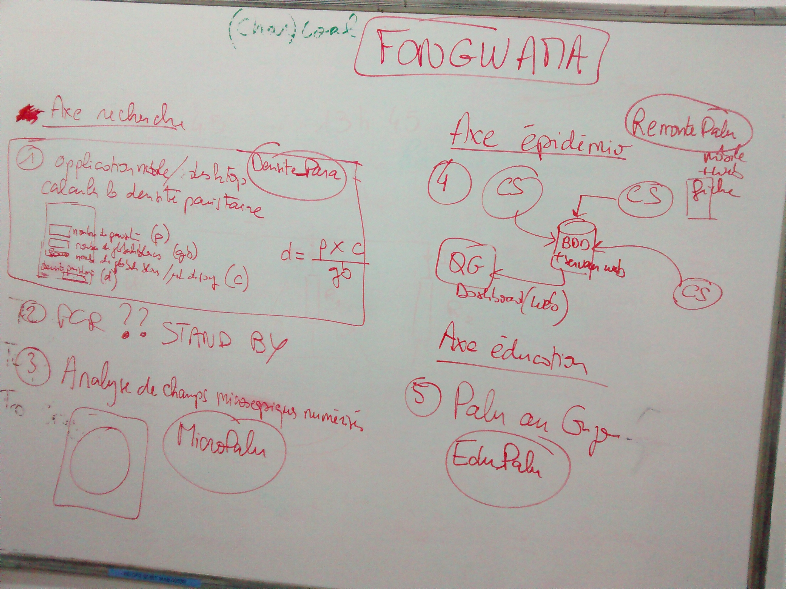

**Compte-rendu de la réunion du 01/07/2015**

Lieu : salle n° 9 du centre de formation ECAir.

Horaires : de 15h45 à 17h45.

Présents :

- Borel Badila (développeur Fongwama)
- Trésor Ngassaki (développeur Fongwama)
- Yann Banvi (développeur Fongwama)
- Delphin Bondongo (développeur Fongwama)
- Prince Youlou (développeur Fongwama)
- Steve Ndende (développeur Fongwama)
- Aris (développeur Fongwama)
- Félix Koukouikila-Koussounda (responsable du laboratoire de biologie moléculaire / FCRM)
- Pierre Poulain (bioinformaticien / FCRM)

Objectifs :

- Préciser les besoins des chercheurs en terme d'applications.
- Faire un point sur l'installation de la plateforme de développements.

# Projets de développements

Le document du 27/06/2015 a servi de base à la discussion. Le projet n°2 concernant l'analyse des produits de PCR à partir des gels d'électrophorèse a été suspendu, le temps d'évaluer les logiciels libres déjà existants pouvant répondre à ce besoin. 

Quatre projets ont été définis.

## Projet DensitePara

Objectif : application pour calculer la densité parasitaire.

Plateforme : mobile et desktop.

La densité parasitaire est un indicateur de la quantité de parasites présents dans un échantillon sanguin. Cet indicateur, combiné aux signes cliniques, permet au médecin d'affiner la prise en charge du patient.

La densité parasitaire est calculée à partir de trois paramètres :

- Nombre de parasites.
- Nombre de globules blancs.
- Nombre moyen de globules blancs par microlitre de sang. Cette valeur est fixée par défaut à 8000 mais doit pouvoir être modifiée si besoin est.

Le nombre de parasites et le nombre de globules blancs sont obtenus par comptage sur une goutte épaisse observée au microscope.

Formule pour calculer la densité parasitaire :

densité parasitaire = nombre de parasites x nombre de globules blancs par microlitre de sang (8000 par défaut) / nombre de globules blancs

L'application sera développée sur la plateforme desktop pour les tests puis déployée sur la plateforme mobile.

Les développeurs peuvent d'ores et déjà démarrer le développement.

## Projet MicroPalu

Objectif : application pour analyser des clichés de goutte épaise ou de frottis obtenus par microscopie.

Plateforme : desktop dans un premier temps puis mobile si la technologie permet de prendre de clichés de goutte épaisse de bonne qualité avec un téléphone portable. 

Ce projet est découpé en trois étapes :

1. Acquérir des images de bonne qualité à partir d'un microscope.
2. Mettre en place une base de données pour conserver ces images et les mettre à disposition du public.
3. Développer un algorithme pour la reconnaissance automatique de parasites à partir des clichés de frottis sanguin ou de goutte épaisse.

L'étape 1 nécessite l'acquisition d'un microscope permettant de numériser des gouttes épaisses et des frottis. Il faut bien sur que les patients acceptent que nous numérisions leurs échantillons sanguins. Ils devront pour cela être informés des objectifs du projet et signer une fiche de consentement. Le projet devra au préalable être évalué par un comité d'éthique.

## Projet RemontePalu 

Objectif : application pour remonter et centraliser les cas clinques de paludisme.

Plateforme : mobile pour la partie client et desktop pour la partie dashboard.

Partie client, depuis les centres de santé : remonter les cas cliniques de paludisme avec les informations suivantes :

- date de naissance du patient ;
- (éventuellement photo du patient) ;
- numéro de téléphone ;
- sexe ;
- densité parasitaire ;
- température corporelle ;
- signes cliniques simples :
    * vomissements, 
    * diarrhées, 
    * courbatures / douleurs musculaires ,
    * maux de tête,
    * affaiblissement,
    * toux.
    
Partie dashboard, depuis le centre de contrôle : suivre les cas de palu.

Le centre de santé de la FCRM situé à Massissia est prêt à servir de pilote pour la partie cliente. Les bureaux de la FCRM situés à l'OMS pourront servir de centre de contrôle. 

Un serveur devra être loué pour :

- Stocker les données remontées par les clients (serveur de base de données de type MySQL).
- Construire le dashboard pour le centre de contrôle (application web adossée à un serveur web).

Est-ce que Skepsos peut s'occuper de la location du serveur (en France) ?

Les développeurs peuvent d'ores et déjà proposer des prototypes pour les parties client et dashboard.

## Projet EduPalu 

Objectif : application pour sensibiliser au paludisme.

Plateforme : mobile.

Thématiques abordées :

- Qu'est-ce que le palu ?
- Comment se protéger du palu ? 
    * Dormir sous une moustiquaire.
    * Ne pas laisser d'eaux stagnantes.
    * porter des vêtements longs et clairs le soir à l'extérieur.
- Que Faire en cas de fièvre ?
    * Ne pas s'automédicamenter.
    * Aller dans un centre de santé pour faire une goutte épaise.
- C'est quoi la goutte épaisse ?
    * Exemple de clichés obtenus par microscopie.
    * Visualisation de parasites.
- Localisation du centre de santé le plus proche.
    * Recensement des centres de santé : nom, adresse, numéro de téléphone, coordonnées GPS.
    * Utiliser le GPS du téléphone pour la géolocalisation.
    
L'application sera disponible en français, lingala et kituba.

Les développeurs vont commencer à développer cette application à partir de leurs propres connaissances sur la palu. Des chercheurs et des médecins viendront ensuite compléter ces informations.

# Installation et fonctionnement de la plateforme Fongwama

## Organisation

Les développeurs doivent définir un responsable et un secrétaire.

## Installation

### Accès à la plateforme

La clef de la salle est disponible à l'accueil du centre de formation.

Les personnes de l'accueil du centre de formation notent les noms des développeurs lors de leurs passages. 

### Accès internet

L'installation de la plateforme n'est pas terminée puisqu'il n'y a pas d'accès internet. Il est impératif qu'une connexion internet haut débit soit installée dans la plateforme de développement.

A titre d'information, une connexion 3G avec 1,5 Go de données par jour pendant 30 jours coûte [60 000 XAF](http://www.mtncongo.net/forfait_volumes.php?page=ff).

### Compte développeur Google

Un compte développeur Google doit être acheté pour que les applications développées par Fongwama soient installables depuis Google Store.

Un compte développeur coute 12 500 XAF. La licence est valable à vie.

### Fontaine à eau

Les développeurs ont besoin d'eau potable pour travailler dans de bonnes conditions.

La fontaine à eau du centre de formation n'est pas fonctionnelle. Est-il possible de remédier à cela ?

### Protection du matériel

Les développeurs souhaitent que les mini-PC soient enfermés dans des boitiers pour éviter d'être volés. 

# Conclusion

Les projets DensitePara, EduPalu et RemontePalu preuvent démarrer. Par contre, une **connexion internet haut débit doit être installée le plus rapidement possible** dans la plateforme de développement, sans quoi le développement devra s'arrêter.

Il faut également acheter un compte développeur Google et louer un serveur pour le projet RemontePalu.

# Références

[Première versions des besoins de développements](../projets_dev_palu_20150627.md) exprimés par les chercheurs de la FCRM.

Copie du tableau prise à l'issue de la réunion.

